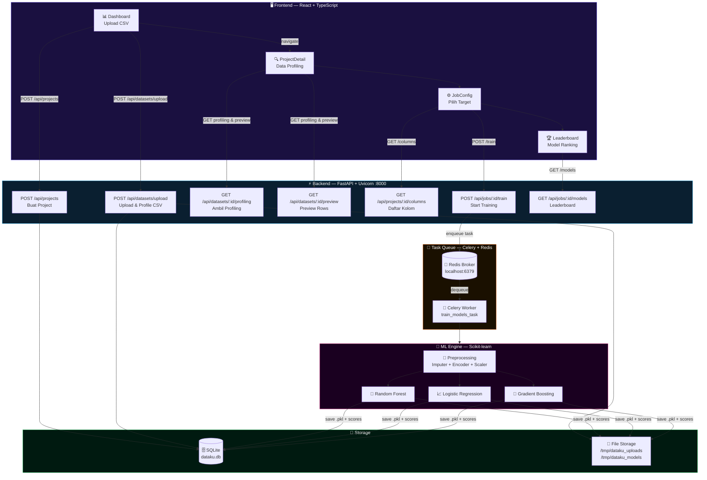

# 🧠 DataKu — AutoML Platform

> **Upload a CSV. Train multiple models. Get results — automatically.**

DataKu adalah platform **AutoML (Automated Machine Learning)** berbasis web yang memungkinkan pengguna untuk mengunggah dataset CSV, melakukan profiling data, melatih beberapa model Machine Learning secara otomatis di latar belakang, dan melihat perbandingan performa model pada sebuah Leaderboard — tanpa perlu menulis satu baris kode pun.

---

## 📸 Screenshots

> *Upload → Profile → Train → Compare*

---

## ✨ Fitur Utama

| Fitur | Deskripsi |
|---|---|
| 📁 **Dataset Upload** | Upload file CSV dengan drag & drop |
| 🔍 **Auto Profiling** | Statistik otomatis: jumlah baris, kolom, missing values, dan tipe fitur |
| 🎯 **Target Selection** | Pilih kolom target yang ingin diprediksi |
| 🤖 **AutoML Training** | Melatih 3 algoritma (Random Forest, Logistic Regression, Gradient Boosting) secara paralel di background |
| 🏆 **Model Leaderboard** | Rangking model berdasarkan Accuracy dan F1-Score secara real-time |
| 📊 **Visual Profiling** | Grafik Recharts untuk missing values dan distribusi tipe fitur |

---

## 🏗️ Arsitektur Sistem



---

## 🛠️ Tech Stack

### Frontend
| Teknologi | Keterangan |
|---|---|
| [React 18](https://react.dev) + [TypeScript](https://www.typescriptlang.org/) | UI Framework |
| [Vite](https://vitejs.dev/) | Build tool & dev server |
| [React Router v6](https://reactrouter.com/) | Client-side routing |
| [shadcn/ui](https://ui.shadcn.com/) | Komponen UI |
| [Recharts](https://recharts.org/) | Visualisasi data |
| [Framer Motion](https://www.framer.com/motion/) | Animasi |
| [Sonner](https://sonner.emilkowal.ski/) | Toast notifications |

### Backend
| Teknologi | Keterangan |
|---|---|
| [FastAPI](https://fastapi.tiangolo.com/) | REST API Framework |
| [SQLAlchemy](https://www.sqlalchemy.org/) | ORM Database |
| [SQLite](https://www.sqlite.org/) | Database (development) |
| [Celery](https://docs.celeryq.dev/) | Asynchronous task queue |
| [Redis](https://redis.io/) | Message broker untuk Celery |
| [Pandas](https://pandas.pydata.org/) | Data processing & profiling |
| [Scikit-learn](https://scikit-learn.org/) | Machine Learning algorithms |
| [XGBoost](https://xgboost.readthedocs.io/) | Gradient boosting |
| [Joblib](https://joblib.readthedocs.io/) | Model serialization |

---

## 🚀 Cara Menjalankan (Local Development)

### Prasyarat
- Node.js 18+
- Python 3.10+
- Redis Server

### 1. Install Redis (jika belum ada)
```bash
# macOS
brew install redis
brew services start redis

# Ubuntu/Debian
sudo apt install redis-server
sudo systemctl start redis
```

### 2. Setup Frontend
```bash
# Di root directory project
npm install
npm run dev
```
Frontend akan berjalan di: **http://localhost:5173** (atau port lain jika sudah digunakan)

### 3. Setup Backend
```bash
cd backend

# Buat virtual environment
python3 -m venv venv
source venv/bin/activate  # Windows: venv\Scripts\activate

# Install dependencies
pip install -r requirements.txt

# Jalankan FastAPI server
uvicorn main:app --reload
```
API akan berjalan di: **http://localhost:8000**
Swagger docs tersedia di: **http://localhost:8000/docs**

### 4. Jalankan Celery Worker (untuk training background)
```bash
# Di folder backend, dengan venv aktif
celery -A core.celery_app worker --loglevel=info
```

---

## 🔌 API Endpoints

| Method | Endpoint | Deskripsi |
|---|---|---|
| `GET` | `/api/projects` | Daftar semua project |
| `POST` | `/api/projects` | Buat project baru |
| `GET` | `/api/projects/{id}` | Detail project |
| `GET` | `/api/projects/{id}/columns` | Daftar kolom dataset |
| `POST` | `/api/datasets/upload` | Upload file CSV |
| `GET` | `/api/datasets/{id}/profiling` | Data profiling dataset |
| `GET` | `/api/datasets/{id}/preview` | Preview 5 baris pertama |
| `POST` | `/api/jobs/{id}/train` | Mulai training AutoML |
| `GET` | `/api/jobs/{id}/models` | Leaderboard model |

---

## 🤖 Alur AutoML

```
Upload CSV
    │
    ▼
Create Project (POST /api/projects)
    │
    ▼
Upload & Profile Dataset (POST /api/datasets/upload)
  - Hitung missing values
  - Identifikasi tipe fitur (Numerical, Categorical, Boolean)
    │
    ▼
Pilih Target Column (GET /api/projects/{id}/columns)
    │
    ▼
Start Training Job (POST /api/jobs/{id}/train) ──► Celery Worker
    │                                                     │
    │                                               Preprocessing:
    │                                               - SimpleImputer
    │                                               - LabelEncoder
    │                                               - StandardScaler
    │                                                     │
    │                                               Train 3 Models:
    │                                               - Random Forest
    │                                               - Logistic Regression
    │                                               - Gradient Boosting
    │                                                     │
    ▼                                               Simpan ke DB (.pkl)
Leaderboard (polling GET /api/jobs/{id}/models)
  - Ranking by Accuracy & F1-Score
  - Deploy best model (coming soon)
```

---

## 📁 File CSV yang Didukung

Dataset CSV yang diupload harus memenuhi kriteria berikut:
- **Format**: `.csv` (comma-separated values)
- **Header**: Baris pertama harus berisi nama kolom
- **Target**: Salah satu kolom harus berisi label klasifikasi (0/1, Yes/No, dll.)
- **Ukuran yang disarankan**: < 100MB untuk performa optimal

---

## 🗺️ Roadmap

- [x] Dashboard & Upload CSV
- [x] Auto Profiling (missing values, feature types)
- [x] Background Training dengan Celery
- [x] Model Leaderboard (Accuracy & F1-Score)
- [x] Deploy model sebagai REST API
- [ ] Support dataset Excel (.xlsx)
- [ ] Hyperparameter tuning dengan Optuna
- [ ] Export laporan PDF
- [ ] Multi-user dengan autentikasi

---

## 🤝 Kontribusi

Pull request sangat disambut! Untuk perubahan besar, mohon buka Issue terlebih dahulu untuk mendiskusikan perubahan yang ingin Anda buat.

```bash
git checkout -b feature/nama-fitur
git commit -m "feat: deskripsi fitur"
git push origin feature/nama-fitur
```

---

## 📄 Lisensi

Proyek ini menggunakan lisensi [MIT](LICENSE).

---

<p align="center">Dibuat dengan ❤️ menggunakan FastAPI + React</p>

## 🤝 Kontribusi

Pull request sangat disambut! Untuk perubahan besar, mohon buka Issue terlebih dahulu untuk mendiskusikan perubahan yang ingin Anda buat.

```bash
git checkout -b feature/nama-fitur
git commit -m "feat: deskripsi fitur"
git push origin feature/nama-fitur
```

---

## 📄 Lisensi

Proyek ini menggunakan lisensi [MIT](LICENSE).

---

<p align="center">Dibuat dengan ❤️ menggunakan FastAPI + React</p>
